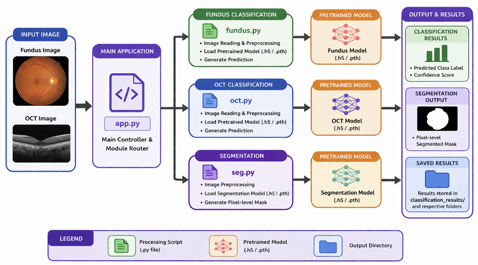
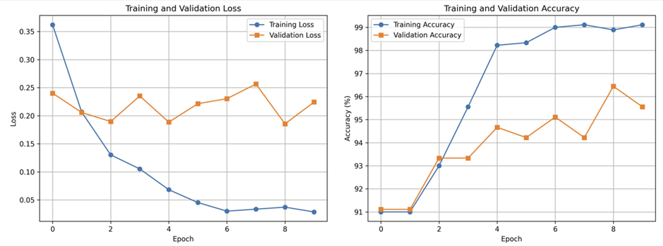
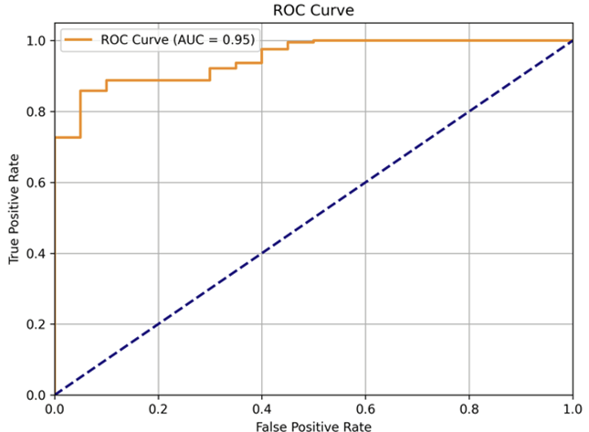
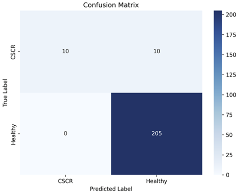
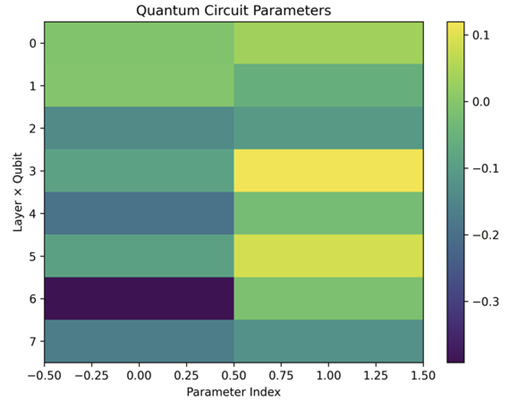

# CSCR_detectionUsingFundusAndOCTImages
## Introduction

This project presents a deep learning-based system for analyzing medical images using two imaging modalities: fundus and Optical Coherence Tomography (OCT). The implementation is structured through multiple Python modules, where dedicated scripts handle classification and segmentation tasks using pretrained models. The system processes input images, applies model inference, and generates prediction outputs along with stored result visualizations.
Existing approaches to medical image analysis often rely on separate pipelines for different imaging modalities and tasks. In this project, a unified structure is implemented where multiple scripts such as fundus.py, oct.py, and seg.py are integrated through a central application file. This allows handling of different image types within a single workflow.
The gap identified in existing workflows is the lack of modular integration of classification and segmentation tasks across multiple image modalities within a single executable structure. This project addresses that gap by organizing model loading, preprocessing, inference, and result storage into a cohesive system using predefined model files and structured directories.

## Motivation
The analysis of medical images such as fundus and OCT scans requires accurate interpretation for identifying patterns and abnormalities. From the project implementation, it is evident that separate scripts are used to process different image types and tasks, indicating the need for an automated system that can handle these operations programmatically.
The presence of multiple pretrained model files and dedicated processing scripts highlights the requirement to efficiently utilize trained models for prediction without retraining. Manual handling of such workflows would involve repeatedly loading models, preprocessing inputs, and managing outputs, which is time-consuming and prone to inconsistency.
This project is motivated by the need to streamline these operations into a single system where image input, model inference, and result generation are handled in a structured and repeatable manner. By integrating classification and segmentation functionalities for fundus and OCT images within one framework, the project reduces complexity and improves execution efficiency.

## Scope of the Project
-	Handles analysis of fundus and OCT medical images 
-	Performs classification using pretrained models 
-	Performs image segmentation using dedicated module 
-	Supports model formats such as .h5, .pth, and. npy 
-	Executes inference without requiring model retraining 
-	Stores outputs in structured result directories 
-	Limited to prediction and result generation pipeline

## Methodology
The project follows a structured step-wise workflow:
-	Step 1: Input medical image is provided to the system
-	Step 2: app.py acts as the main controller and routes the input to the appropriate module
-	Step 3: Based on input type, fundus.py or oct.py is invoked for classification
-	Step 4: Image preprocessing is performed before model inference
-	Step 5: Pretrained models (.h5, .pth) are loaded and used for prediction
-	Step 6: For segmentation tasks, seg.py processes the image and generates pixel-level outputs
-	Step 7: Prediction results and processed outputs are saved in directories such as classification_results
-	This methodology integrates input handling, model execution, and output storage into a unified pipeline.
 
Fig: System Architecture of the Proposed Multi-Modal Medical Image Analysis Pipeline

## Results
The system successfully generates outputs for both classification and segmentation tasks across fundus and OCT images. The pretrained models are able to process input images and produce prediction results, which are stored in structured directories such as classification_results.
Segmentation outputs are generated as processed images, demonstrating that the segmentation module performs pixel-level analysis effectively. The presence of saved outputs and result files confirms that the inference pipeline executes correctly across different modules.
The results indicate consistent functioning of the system, where multiple image types are handled within a single workflow and outputs are generated in an organized manner.
 
Fig: Model Training Performance: Loss and Accuracy Across Epochs

 
Fig: Receiver Operating Characteristic (ROC) Curve (AUC = 0.95)

 
Fig: Confusion Matrix Showing Classification Performance of the Proposed Model

 

Fig: Visualization of Quantum Circuit Parameters Using Heatmap Representation

## Conclusion
The project successfully implements a unified and modular pipeline for medical image analysis using pretrained deep learning models. It integrates classification and segmentation functionalities for fundus and OCT images within a single structured system.
The results support the objective of developing a consistent inference-based framework capable of handling multiple image modalities. The use of pretrained models ensures efficient execution without retraining, while the modular design improves clarity and maintainability.
The system can be further extended by enhancing model performance, adding more image modalities, or developing a user interface for improved usability.

REFERENCES

[1]	Aktar, S., Ahamad, M. M., Rabbani, M., Tian, S., Mia, M. R., Tabassum, F., ... & Ahamed, S. I. (2025). A systematic review on eye as a biomarker and an application of quantum neural network. Cureus Journals, 2(1).
 
[2]	Alqassab, A. I. M., Luque-Nieto, M. Á., & Mohammed, M. A. (2026). Identification of multiple ocular diseases using a hybrid quantum convolutional neural network with fundus images. Scientific Reports.
 
[3]	Acuña Acuña, E. G. (2025). Quantum-assisted early detection of diabetic retinopathy: A novel integration of quantum machine learning in biomedical imaging. Med Data Min, 8(3), 18.
 
[4]	Masum, A. K. M., Khan, M. F. I., Hassan, M. M., Farid, D. M., Bitto, A. K., & Rahman, M. A. (2025, July). Multi-Model Ensemble Approach for Accurate Classification of Ocular Disorders. In 2025 International Conference on Quantum Photonics, Artificial Intelligence, and Networking (QPAIN) (pp. 1-6). IEEE.
 
[5]	Haq, N. U., Waheed, T., Ishaq, K., Hassan, M. A., Safie, N., Elias, N. F., & Shoaib, M. (2024). Computationally efficient deep learning models for diabetic retinopathy detection: a systematic literature review. Artificial Intelligence Review, 57(11), 309.
 
[6]	Liu, Y., Tang, Z., Li, C., Zhang, Z., Zhang, Y., Wang, X., & Wang, Z. (2024). AI-based 3D analysis of retinal vasculature associated with retinal diseases using OCT angiography. Biomedical Optics Express, 15(11), 6416-6432.
 
[7]	Rozhyna, A., Somfai, G. M., Atzori, M., DeBuc, D. C., Saad, A., Zoellin, J., & Müller, H. (2024). Exploring publicly accessible optical coherence tomography datasets: a comprehensive overview. Diagnostics, 14(15), 1668.
 
[8]	Mani, P., Ramachandran, N., Paul, S. J., & Ramesh, P. V. (2024). Laceration assessment: advanced segmentation and classification framework for retinal disease categorization in optical coherence tomography images. Journal of the Optical Society of America A, 41(9), 1786-1793.
 
[9]	Gibczynski, K., Orzechowska, M., Jablonska, K., Lesniewski, K., Paluch, P., Roztoczyńska, A., ... & Pudźwa, J. (2025). MODERN TECHNOLOGIES IN THE DIAGNOSIS AND TREATMENT OF RETINAL DISEASES-A LITERATURE REVIEW. ARCHIV EUROMEDICA, 15(1).
 
[10]	Rozhyna, A., Somfai, G. M., Atzori, M., DeBuc, D. C., Saad, A., Zoellin, J., & Müller, H. (2024). Exploring publicly accessible optical coherence tomography datasets: a comprehensive overview. Diagnostics, 14(15), 1668.

